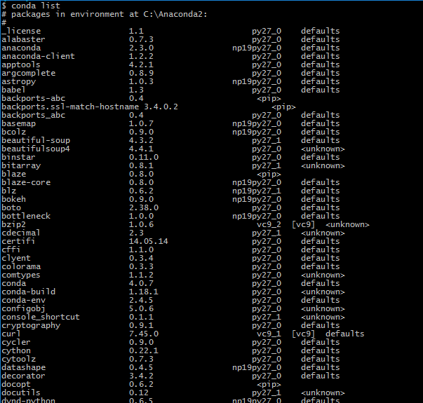

[Voltar](README.md)

# Conteúdo

Introdução à linguagem Python 

- [x] [Linguagem Compilada x Interpretada](#sec1)
- [x] [Instalação dos Pacotes Python](#sec2)
- [x] [Introdução ao python utilizando notebooks no Jupyter](#sec3)
- [x] [Sopa: Git, GitHub, Markdown](#sec4)
- [x] [O que posso fazer com Python?](#sec6)
- [x] [Qual IDE é a melhor?](#sec7)
- [x] [Ambientes Virtuais, máquinas virtuais, o que é isso?](#sec8)
- [x] [Vamos colocar a mão na massa!](#sec9)
- [x] [Vamos colocar a mão na massa 2 - NumPy, Matplotilib!](#sec10)
- [x] [Como avaliar se devo realmente comprar um livro de Python](#sec11)
- [x] [Não tenho grana para comprar um computador!!](#sec12)

> Referência 1:  <a href="http://ricardoduarte.github.io/python-para-desenvolvedores/#conteudo" target="_blank">Livro Python para Desenvolvedores</a>

> Referência 2: <a href="panda.ime.usp.br/aulasPython/static/aulasPython/" target="_blank">Introdução à computação em Python (IME-USP)</a>

> Referência 3:  <a href="https://docs.python.org/3/tutorial/" target="_blank">Tutorial Oficial do Python 3</a>

> Referência 4:  <a href="https://python.nilo.pro.br/index.html" target="_blank">Introdução à programação em Python</a>

> Referência 5:  <a href="opentechschool.github.io/python-beginners/en/index.html" target="_blank">Python for Begginers</a>

[Voltar para Índice](#indice)
## Falar que a linguagem Python é interpretada está correto?

* <a href="http://www.toptal.com/python/por-que-h-tantos-pythons/pt" target="_blank">**Extraído do artigo: Por que há tantos Pythons?**</a>

## “Python é interpretado ou compilado?”

Este é um ponto comum de confusão para iniciantes em Python.

> Iniciantes assumem que Python é compilado por causa dos arquivos .pyc. Há alguma verdade nisto: o arquivo .pyc é bytecode compilado, que é depois interpretado. Então se você rodou seu código Python antes e tem o arquivo .pyc disponível, ele vai rodar mais rápido na segunda vez, já que não precisará recompilar o bytecode.

A primeira coisa a perceber é que **‘Python’ é uma interface**. Há uma especificação do que Python deveria fazer e como deveria se comportar (como qualquer interface). E há múltiplas implementações (como com qualquer interface).

> A segunda coisa a perceber é que **‘interpretado’ e ‘compilado’** são propriedades de uma implementação, não de uma interface.

## Então a questão em si não está bem formulada.

**Python é interpretado ou compilado?** A questão não está realmente bem formulada.
Dito isso, para a implementação mais comum (CPython: escrita em C, frequentemente referenciada simplesmente como ‘Python’, e certamente o que você está usando se você não tem ideia do que estou falando), **a resposta é:** interpretada, **com alguma compilação**. CPython compila** código fonte Python para bytecode, e depois *interpreta este bytecode, executando conforme progride.

> * Nota: isto não é ‘compilação’ no sentido tradicional da palavra. Tipicamente, diríamos que ‘compilação’ é pegar uma linguagem de alto nível e convertê-la para código de máquina. Mas é uma certa ‘compilação’.

## Bytecode vs. Código de Máquina

É muito importante entender a diferença entre bytecode e código de máquina (ou nativo), talvez melhor ilustrado pelo exemplo:

C compila para código de máquina, que é depois executado diretamente no seu processador. Cada instrução instrui sua CPU a mover coisas por toda parte.
Java compila para bytecode, que depois é executado na Java Virtual Machine (JVM), uma abstração de um computador que executa programas. Cada instrução é então tratada pela JVM, que interage com seu computador.
Em termos breves: código de máquina é muito mais rápido, mas bytecode é mais portável e seguro.

Código de máquina parece diferente dependendo de sua máquina, mas bytecode se parece igual em todas as máquinas. Alguém pode dizer que código de máquina é otimizado para sua configuração.

Retornando ao CPython, o processo de toolchain é como segue:

CPython compila seu código fonte Python para bytecode.
Este bytecode é então executado na Máquina Virtual CPython.

## JIT: O Por Que e o Como

Lembre-se que código de máquina nativo é muito mais rápido que bytecode. *Bem, e se pudéssemos compilar parte de nosso bytecode e depois rodá-lo como código nativo**? Teríamos que pagar um certo preço para compilar o bytecode (isto é, tempo), mas se o resultado final fosse mais rápido, seria ótimo! Esta é a motivação da compilação JIT, uma técnica híbrida que mistura os benefícios de interpretadores e compiladores. Em termos básicos, JIT quer utilizar compilação para acelerar um sistema interpretado.

> Por exemplo, uma abordagem tomada pelos JITs:

> * Identificar bytecode que é executado frequentemente.
> * Compilá-lo para código de máquina nativo.
> * Fazer cache do resultado.
> * Sempre que o mesmo bytecode estiver para ser executado, ao invés disso usar o código de máquina pré-compilado e colher os frutos (isto é, ganhos de velocidade).

 

## Instalação do Python e de suas dependências

Uma maneira fácil de baixar e instalar a última versão do Python e de suas 
dependências é utilizar a distribuição [Anaconda](http://continuum.io/downloads), 
da [Continuum Analytics](http://continuum.io/). Para tanto:

1. Acesse o link do [Anaconda](http://continuum.io/downloads), 
escolha o instalador `PYTHON 2.X` adequado para o seu sistema
operacional e siga as instruções. O Anaconda já vem com quase tudo o que você 
precisa para fazer os seus primeiros códigos.

2. Para checar se a instalação deu certo, abra uma janela do prompt de comando,
caso você esteja no Windows, ou um terminal, se estiver no Linux.

3. Digite o comando: `conda list`. Este comando mostrará uma
 lista de *coisas* que foram instaladas pelo Anaconda. Deve aparecer
 algo do tipo:
 
 
 
 Nesta lista, procure os itens: `python`, `ipython`, `ipython-notebook`, `jupyter`, 
 `numpy`, `matplotlib` e `scipy`. Se estes itens estiverem na lista, fique
 tranquilo(a)... pelo menos por enquanto :).

 

[Voltar para Índice](#indice)
## Jupyter Notebook

O [Jupyter Notebook](http://jupyter.readthedocs.org/) é um
arquivo com extensão `.ipynb` e
permite combinar código, texto, equações feitas em 
LaTeX, figuras e animações. Além disso, 
é gratuito e extremamente bem documentado. Esta poderosa feramenta computacional 
possibilita reunir (quase) todas as etapas envolvidas no desenvolvimento de 
um código com fins acadêmicos, desde a leitura e processamento dos dados até a 
visualização dos resultados. Para informações sobre o Jupyter Notebook, 
acesse:

* > Referência:  <a href="https://jupyter-notebook.readthedocs.io/en/latest/notebook.html" target="_blank">Jupyter Notebook</a>

 

[Voltar para Índice](#indice)
## Visualização dos Jupyter Notebooks

No GitHub os arquivos **.ipynb** ficam estáticos. Para rodá-los é preciso baixá-los e ir teclando Shift + Enter para executá-los.

Note que, desta forma, os Jupyter Notebooks são vistos como páginas
estáticas. Para executar um determinado Jupyter Notebook, é necessário 
baixa-lo e instalar os programas necessários de acordo com a seção
**Instalação do Python e de suas dependências**.

 

[Voltar para Índice](#indice)
## GIT e GitHub

### O que é GIT? 

### Como faço para utilizar o GitHub?

Acessem os links:

* <a href="https://tableless.com.br/tudo-que-voce-queria-saber-sobre-git-e-github-mas-tinha-vergonha-de-perguntar" target="_blank">Tudo que você queria saber sobre Git e GitHub, mas tinha vergonha de perguntar</a>

* [Git e Github para Iniciantes](http://willianjusten.teachable.com/courses/git-e-github-para-iniciantes)

* [tryGit - Got 15 minutes and want to learn Git?](https://try.github.io/levels/1/challenges/1)

* [Good Resources for Learning Git and GitHub](https://help.github.com/articles/good-resources-for-learning-git-and-github/)

 

## O que posso fazer com Python?

[O Céu é o limite!](https://ericstk.wordpress.com/2014/09/30/python-powered-coisas-que-python-pode-fazer-e-voce-nao-sabia/)

Posso fazer uma página Web?
[Que tal o Flask!?](http://flask.pocoo.org/docs/0.11/)

Dá para o script baixar coisas da Web?
[Que tal o requests!?](http://docs.python-requests.org/en/master/)

 

## Qual IDE utilizar?

[PyCharm](https://www.jetbrains.com/pycharm/download/#section=windows)

[PyScripter](https://sourceforge.net/projects/pyscripter/)

**Por que utilizar IDE?**
 

 
 

## Ambientes Virtuais - Máquinas Virtuais?

O que são? Vamos falar disso...

 
 

## Vamos colocar a mão na massa 1!

Vide pasta scripts/p01

 
 

## Vamos colocar a mão na massa 2!

Capítulo 32 do 
<a href="http://ricardoduarte.github.io/python-para-desenvolvedores/#conteudo" target="_blank">Livro Python para Desenvolvedores</a>

<a href="http://github.com/thsant/scipy-intro" target="_blank">Sci Py</a>

 
 

## Como avaliar um livro para aprender?!

Devemos começar pelo código fonte dele! Que tal?

<a href="https://python.nilo.pro.br/index.html" target="_blank">Introdução à programação em Python</a>

 
 

## Desculpa, não tenho computador?!

Devemos começar pelo código fonte dele! Que tal?

<a href="https://blog.filipeflop.com/embarcados/tutorial-raspberry-pi-linux.html" target="_blank">Você já conhece? Peça para lhe mostrar um!</a>

 
